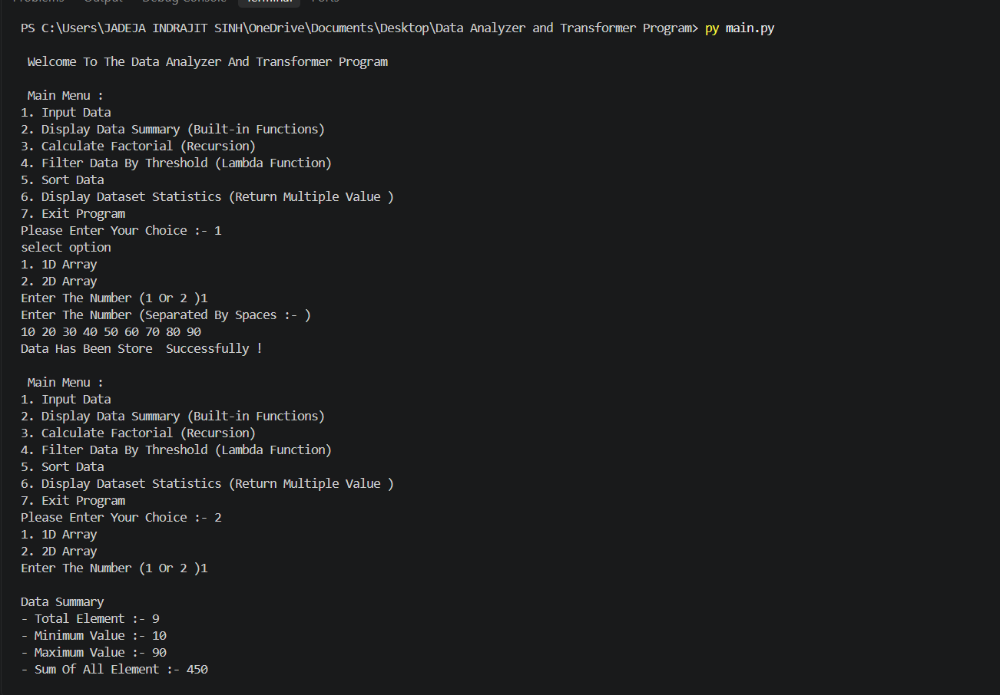

# 📊 Data Analyzer and Transformer Program

## 🐍 Python-Based Data Analysis and Transformation Tool

A console-based Python application that allows users to input numerical data and perform various operations such as data analysis, filtering, sorting, factorial calculation, and statistical calculations.

---

## ✨ Features

* 📥 Input 1D Array
* 📥 Input 2D Array
* 📊 Display Data Summary
* 🧮 Calculate Factorial using Recursion
* 🔎 Filter Data using Threshold
* 🔃 Sort Data in Ascending Order
* 🔃 Sort Data in Descending Order
* 📈 Display Dataset Statistics
* ➕ Calculate Sum and Average
* 🔢 Find Minimum and Maximum Values
* 🚪 Exit Program

---


## 🛠️ Technologies Used

* **Python 3** – Main programming language
* **Git** – Version control system
* **GitHub** – Repository and code hosting platform

---

## 🧠 Concepts Used

This project demonstrates the following Python concepts:

* Variables
* Lists
* Functions
* Global Variables
* Conditional Statements (`if`, `elif`, `else`)
* `for` Loop
* `while` Loop
* User Input
* Recursion
* Lambda Functions
* `filter()`
* `sorted()`
* `min()`
* `max()`
* `sum()`
* Multiple Return Values
* f-Strings

---

## ▶️ How to Use

Run the Python program and the following main menu will appear:

```text
Main Menu

1. Input Data
2. Display Data Summary
3. Calculate Factorial (Recursion)
4. Filter Data By Threshold
5. Sort Data
6. Display Dataset Statistics
7. Exit Program

Please Enter Your Choice :-
```

Enter a number from `1` to `7` to perform the required operation.

### Input Data

Select option `1` to enter data.

You can choose:

```text
1. 1D Array
2. 2D Array
```

For a 1D array, enter numbers separated by spaces:

```text
10 20 30 40 50
```

The program then stores the data and allows you to perform different operations.

---

## 📦 Installation

### 1. Install Python 3

Download and install Python 3 on your computer.

Check whether Python is installed:

```bash
python --version
```

### 2. Clone the GitHub Repository

```bash
git clone https://github.com/your-username/data-analyzer-and-transformer.git
```

### 3. Open the Project Folder

```bash
cd data-analyzer-and-transformer
```

### 4. Run the Program

```bash
python data_analyzer.py
```

### Requirements

No external Python libraries are required.

The project uses standard Python functionality.

---

## 🖥️ Example Output

### Main Menu

```text
Main Menu

1. Input Data
2. Display Data Summary
3. Calculate Factorial (Recursion)
4. Filter Data By Threshold
5. Sort Data
6. Display Dataset Statistics
7. Exit Program

Please Enter Your Choice :- 1
```

### Input Data

```text
Select Option

1. 1D Array
2. 2D Array

Enter The Number (1 Or 2): 1

Enter The Number (Separated By Spaces):
10 20 30 40 50

Data Has Been Stored Successfully!
```

### Data Summary

```text
Data Summary

- Total Element :- 5
- Minimum Value :- 10
- Maximum Value :- 50
- Sum Of All Element :- 150
- Average Value :- 30.0
```

### Factorial

```text
Enter A Number To Calculate Factorial :- 5

Factorial of 5 is 120
```

### Sorting

```text
Choose Sorting Option

1. Ascending Order
2. Descending Order

Enter Your Choice :- 1

[10, 20, 30, 40, 50]
```

### Output Screenshot

The project also includes an output screenshot:



---

## 📁 Project Structure

```text

│
├── data_analyzer.py
├── output.png
└── README.md
```

### File Description

| File               | Description               |
| ------------------ | ------------------------- |
| `data_analyzer.py` | Main Python program       |
| `output.png`       | Program output screenshot |
| `README.md`        | Project documentation     |

---

## 👨‍💻 Author

**INDRAJIT SINH**
